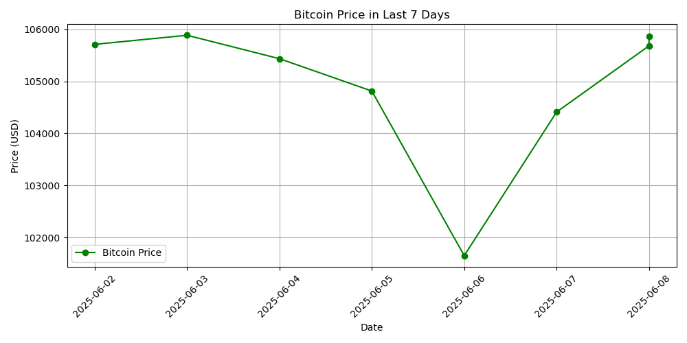

# 🪙 Crypto Dashboard Project

A fully modular Python project that fetches, processes, and visualizes **live cryptocurrency price data** using public APIs (like CoinGecko). This dashboard is built to showcase clean architecture, data processing, and visualization capabilities—perfect for AI and data-driven applications.

---

## 🌟 Features

✅ Fetches real-time prices for cryptocurrencies (e.g., **Bitcoin**, **Ethereum**)  
✅ Saves data in JSON and CSV formats  
✅ Generates clean line charts using Matplotlib  
✅ Includes Streamlit-ready structure for dashboard apps  
✅ Clear modular code: separation of fetch, process, plot logic

---

## 📁 Project Structure

```
crypto_dashboard_project/
├── learning_steps/
│   ├── step1_data_fetch.py
│   ├── step2_data_process.py
│   ├── step3_plot_chart.py
│   ├── step4_save_plot.py
│   └── btc_data.json / btc_prices.csv / btc_price_chart.png
├── final_project/
│   ├── main.py
│   ├── utils.py
│   ├── README.md
│   └── requirements.txt
```

---

## 🚀 How to Run

1. **Clone the repository**  
```bash
git clone https://github.com/alireza-irman/crypto_dashboard_project.git
cd crypto_dashboard_project/final_project
```

2. **Create virtual environment (optional but recommended)**  
```bash
python -m venv venv
source venv/bin/activate   # on Linux/Mac
venv\Scripts\activate      # on Windows
```

3. **Install dependencies**  
```bash
pip install -r requirements.txt
```

4. **Run the main script**  
```bash
python main.py
```

---

## 📊 Sample Output



---

## 🧠 Tech Stack

- Python 3.x
- Requests (for API calls)
- Pandas (for data handling)
- Matplotlib (for visualization)
- Streamlit (dashboard-ready design)

---

## 🛡 License

This project is licensed under the MIT License – see the [LICENSE](../LICENSE) file for details.

---

## 🌐 Author

**Alireza Irman**  

📂 GitHub: [alireza-irman](https://github.com/alireza-irman)
